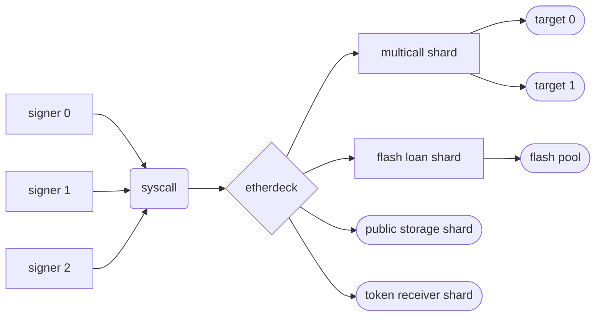
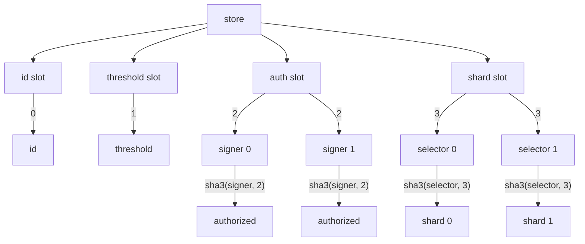

# Ether Deck

A gas optimized, extensible smart wallet.



## Security Considerations

> IMPORTANT: read this. do not self rug.

### Shards

Shards are code fragments that may be delegated to if no function selector is matched. This allows
for arbitrary extensions of executable code, token receiver callback integration, and
upgradeability.

However, because shards use the `delegatecall` instruction, they have full write authority to the
main wallet, including authorization and threshold slots. It is imperative that precautions are
taken to avoid storage collisions and to only use trusted code.

The built-in selectors are reserved for the built-in functions and setting the shard address for
any of them will *not* take precedence over the built-ins. That is to say, shard selectors that
match the built-in selectors will never be delegatecalled to.

When creating new shards, it is important to note that if a requirement that the caller is not the
current address, it will bypass the authorization checks and may be called by anyone. Therefore,
only stateless and read-only shards may omit authorization checks safely. Otherwise, stateful or
externally calling shards should implement the equivalent of the following.

```solidity
require(msg.sender == address(this));
```

### Syscalls

The `syscall` function, which verifies signatures in a loop, assumes the length of the signature
array is equal to the current threshold. This means if the number of signatures is less than the
threshold, the call fails. However, since the signatures are appended to the end of the calldata, if
the number of signatures is greater than the threshold, the remaining signatures will be ignored.

Additionally, the signature verification loop assumes signatures are in ascending order of
associated public keys. That is to say each recovered address MUST be greater than the last. If this
is false, the transaction will revert. This satisfies the following invariants.

1. Any `ecrecover` operation that resolves to the zero address reverts.
2. Any duplicate signer in the signature list reverts.
3. Signature malleability reverts.

### Invariants

- the authorization, threshold, and shards may only be set via a self-call
  - through a syscall
  - through a shard
- selectors mapping to null shards will never trigger an external call
- forks with different chain ids may will not enable chain-id based replay attacks
- signatures with no recovery address will throw
- signatures with an unauthorized recovery address will throw
- signature list length less than the threshold will throw
- signatures in the signature list beyond the threshold will be ignored
- signatures with duplicate addresses in the list will throw
  - replay attacks will throw
  - signature malleability will throw
  - multiple signatures from the same private key will throw

### Assumptions

- syscall call value will not exceed `2 ** 88 - 1`
- syscall payload length, in bytes, will not exceed `2 ** 32 - 1`
- syscall payload length is correct
- syscall calldata is packed tightly according to the [abi specification](src/lib/libabi.huff)
- syscall signatures are packed tightly as `v_u8 . r_b32 . s_b32`
- syscall signatures list has a length equal to the current threshold
- syscall signatures are sorted in ascending order of signer's address
- signers that authorize a shard are aware of its storage interactions
- signers that authorize a shard are aware of its external call interactions
- signers that authorize a shard are aware of its invariants
- signers will not set shard selectors to be one of the reserved selectors
- block timestamp will not exceed `2 ** 64 - 1`

## Application Binary Interface

### Built-in Function Selectors

- `0x00000001` : set authorization
- `0x00000002` : set threshold
- `0x00000003` : set shard
- `0x00000004` : syscall

### Events

- `AuthSet(address indexed account, bool indexed auth)`
- `ThresholdSet(uint8 indexed threshold)`
- `ShardSet(bytes4 indexed selector, address indexed target)`
- `Syscall(uint256 indexed id)`

### Errors

- `Auth()` : authorization failure
- `Deadline()` : deadline less than current block timestamp
- `Dispatch()` : function selector was not matched to a built-in or shard

## Storage Layout

Solidity's storage layout pattern is followed for developer ergonomics and familiarity. The
following is a solidity representation of the contract's internal storage layout.

```solidity
abstract contract Storage {
    uint256 internal id;
    uint8 internal threshold;
    mapping(address => bool) internal authmap;
    mapping(bytes4 => address) internal shardmap;
}
```

The following is a mermaid flow chart representing the contract's internal storage layout.



## Tooling

The list of tooling and libraries is limited at the moment.

- [Deck Tools (Solidity)](src/util/DeckTools.sol): unoptimized, used for tests
- [Multicall Shard Tools (Solidity)](src/util/MulticallShardTools.sol): unoptimized, used for tests
- [ABI Library (Huff)](src/lib/libabi.huff): minimal abi spec and layout docs
- [Type Casting Library (Huff)](src/lib/libcast.huff): only contains relevant types atm
- [ECDSA Library (Huff)](src/lib/libecdsa.huff): elliptic curve moon maths
- [Error Library (Huff)](src/lib/liberr.huff): error handling
- [Storage Library (Huff)](src/lib/libstore.huff): storage layout and computation

### Shards

- [Multicall (Huff)](src/shards/multicall.huff): Optimized multicall, contiains auth check
- [Public Storage (Huff)](src/shards/pubstore.huff): Public storage reader, read-only
- [Recv (Huff)](src/shards/recv.huff): ERC721Receiver and ERC1155Receiver compliant, stateless
