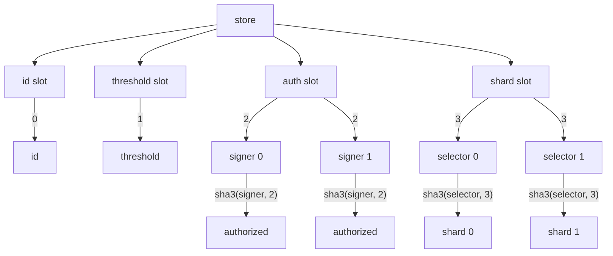

# Ether Deck

A gas optimized, extensible smart wallet.

## TODO

- invariant / fuzz test sigs
- test failures
- test token receiver shard
- create & test multi call shard
- create & test flashloan shard
- create & test pub storage shard
- test for events
- reduce `id` size
- document all assumptions
- document invariants
- tests `id` increment

## Security Considerations

Shards are code fragments that may be delegated to if no function selector is matched. This allows
for arbitrary extensions of executable code, token receiver callback integration, and
upgradeability.

However, because shards use the `delegatecall` instruction, they have full write authority to the
main wallet, including authorization and threshold slots. It is imperative that precautions are
taken to avoid storage collisions and to only use trusted code.

The built-in selectors are reserved for the built-in functions and setting the shard address for
any of them will *not* take precedence over the built-ins. That is to say, shard selectors that
match the built-in selectors will never be delegatecalled to.

The `syscall` function, which verifies signatures in a loop, assumes the length of the signature
array is equal to the current threshold. This means if the number of signatures is less than the
threshold, the call fails. However, since the signatures are appended to the end of the calldata, if
the number of signatures is greater than the threshold, the remaining signatures will be ignored.

Additionally, the signature verification loop assumes signatures are in ascending order of
associated public keys. That is to say each recovered address MUST be greater than the last. If this
is false, the transaction will revert. This satisfies the following invariants.

1. Any `ecrecover` operation that resolves to the zero address reverts.
2. Any duplicate signer in the signature list reverts.
3. Signature malleability reverts.

## Application Binary Interface

### Built-in Function Selectors

- `0x00000001` : set authorization
- `0x00000002` : set threshold
- `0x00000003` : set shard
- `0x00000004` : syscall

### Events

- `AuthSet(address indexed account, bool indexed auth)`
- `ThresholdSet(uint8 indexed threshold)`
- `ShardSet(bytes4 indexed selector, address indexed target)`
- `Syscall(uint256 indexed id)`

## Storage Layout

Solidity's storage layout pattern is followed for developer ergonomics and familiarity. The
following is a solidity representation of the contract's internal storage layout.

```solidity
abstract contract Storage {
    uint256 internal id;
    uint8 internal threshold;
    mapping(address => bool) internal authmap;
    mapping(bytes4 => address) internal shardmap;
}
```

The following is a mermaid flow chart representing the contract's internal storage layout.


